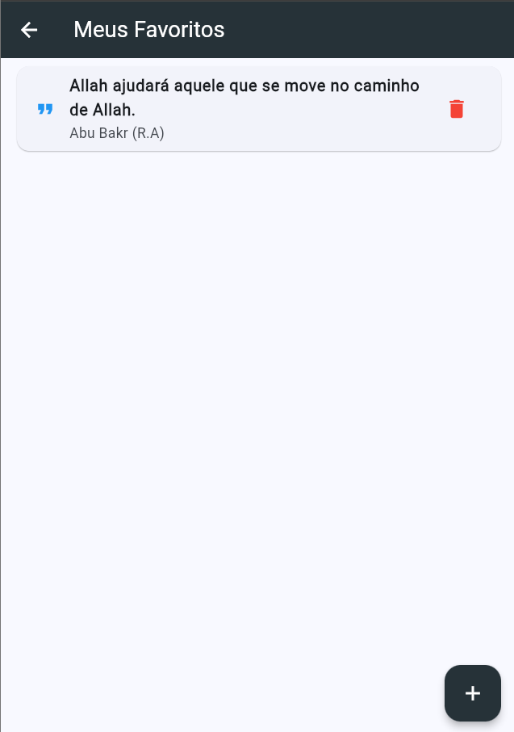
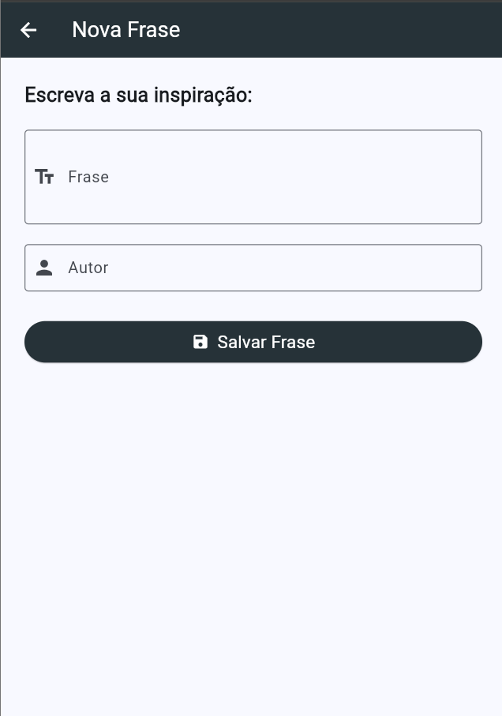

# 🍀 Frases Motivacionais (Web App)

Um aplicativo web construído em **Flutter** para entregar inspiração diária. O projeto consome uma API de citações, traduz automaticamente para o português e permite que o usuário gerencie e compartilhe suas frases favoritas.

**📌 Visitar[ Frases Motivacionais](https://frases-motivacionais-jlzp.onrender.com)** 

## 📸 Capturas de Tela

<table align="center">
  <tr>
    <td align="center">
      
      <br>
      <b>Tela Principal</b>
    </td>
    <td align="center">
      
      <br>
      <b>Meus Favoritos</b>
    </td>    
    <td align="center">
      
      <br>
      <b>Nova Frase</b>
    </td>
  </tr>
</table>

---

## ✨ Funcionalidades

* **Frase do Dia (API):** Consumo da API `dummyjson.com` para buscar frases aleatórias.
* **Tradução Automática:** Integração com o Google Translator para exibir as frases em português.
* **Favoritos (Local Storage):** Salvamento de frases favoritas diretamente no navegador do usuário usando `shared_preferences`.
* **Adicionar Frases Próprias:** Formulário para o usuário escrever e salvar suas próprias inspirações.
* **Compartilhamento:** Botão integrado para compartilhar as frases facilmente com outras pessoas.

## 🛠️ Tecnologias Utilizadas

* **Framework:** [Flutter](https://flutter.dev/) (Focado em Web)
* **Linguagem:** Dart
* **Pacotes Principais:**
  * `http`: Para requisições na API.
  * `translator`: Para tradução de textos.
  * `share_plus`: Para compartilhamento nativo.
  * `shared_preferences`: Para persistência de dados local.

## 📂 Arquitetura do Projeto

O código está organizado para facilitar a manutenção e a escalabilidade:

```text
lib/
├── model/
│   └── Frase.dart                # Classe POO para mapeamento da API
├── telas/
│   ├── tela_principal.dart       # Tela inicial (Design e Chamada da API)
│   ├── tela_favoritos.dart       # Listagem e exclusão de frases salvas
│   └── tela_adicionar_frase.dart # Formulário para novas frases
└── main.dart                     # Ponto de entrada e configuração de tema